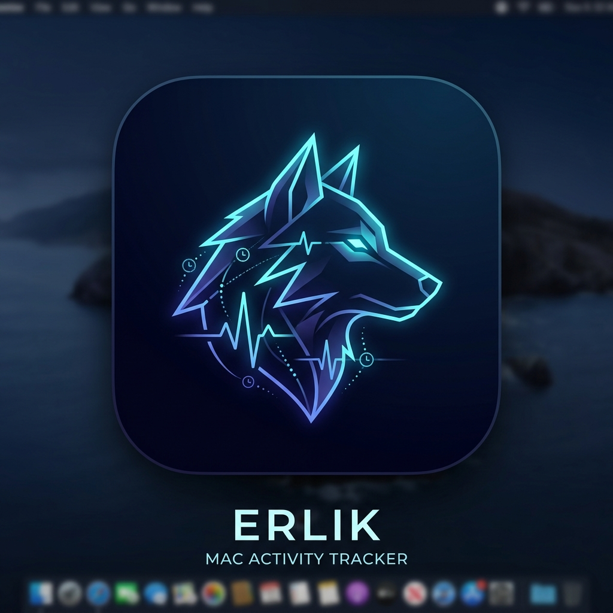
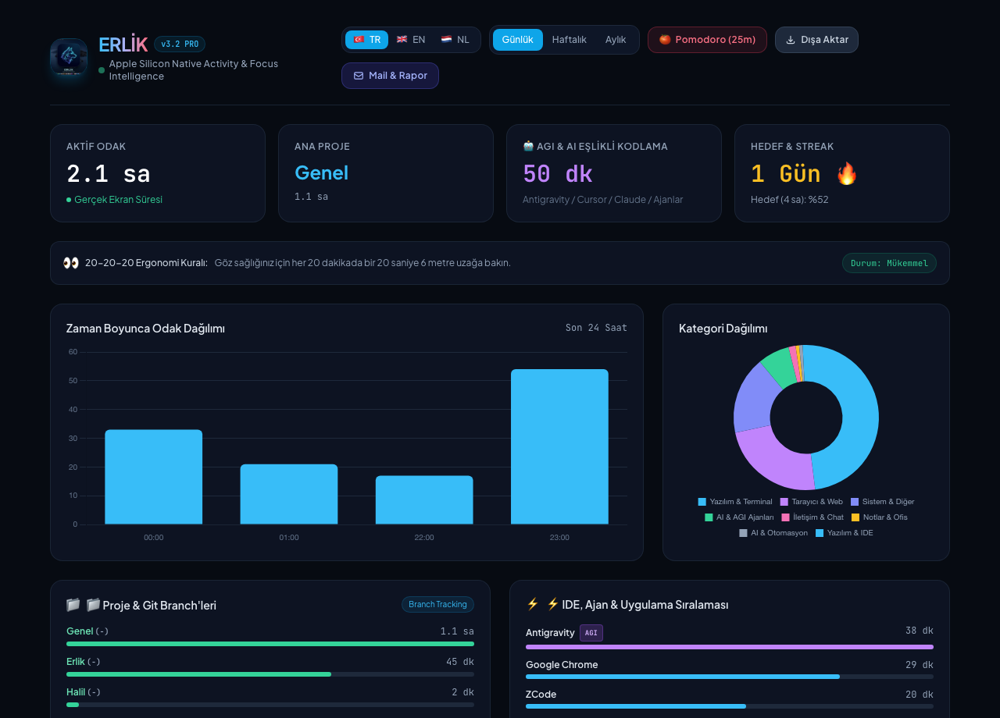

# 🐺 ERLİK — Open Source Native Mac Activity & Focus Intelligence

<p align="center">
  
</p>

<p align="center">
  <b>Apple Silicon (ARM64) Open Source, Zero-Memory Activity, IDE, AGI & Focus Intelligence Tracker for macOS</b><br>
  <i>Named after Erlik Khan, the mythological ruler of deep records and tracking.</i>
</p>

<p align="center">
  <a href="#-about--overview">About</a> •
  <a href="#-dashboard-preview">Preview</a> •
  <a href="#-features">Features</a> •
  <a href="#-ide--agi-agents">IDE & AGI Detection</a> •
  <a href="#-activitywatch-comparison">Comparison</a> •
  <a href="#-quick-start">Quick Start</a> •
  <a href="#-homebrew-installation">Homebrew</a>
</p>

---

## 📸 Dashboard Preview

<p align="center">
  
</p>

---

## 📖 About / Overview

**ERLİK** is an ultra-lightweight, privacy-first activity and focus tracking suite built purely in **Swift (Apple Silicon ARM64 native)** for modern software engineers, researchers, and AI builders.

Unlike heavy Python/Qt/Electron applications (like ActivityWatch or RescueTime) that consume 200MB+ RAM and constantly wake up CPU cores, **ERLİK directly hooks into macOS Darwin Kernel APIs** (`IOHIDSystem`, `NSWorkspace`, `AppleScript`). It operates at ~8 MB of RAM, produces zero CPU drain, and guarantees that 100% of telemetry stays strictly on your machine in a local SQLite database (`erlik.db`).

### 🌟 Why ERLİK?
- 🔋 **Zero Battery Drain:** Extremely battery-friendly for MacBook users on the go.
- 🔒 **100% Privacy & Local-First:** No telemetry leaves your machine. Full data ownership.
- 🤖 **Autonomous AI & AGI Recognition:** Automatically separates active coding time inside AI tools (Antigravity, Cursor, Claude Code, Windsurf, Hermes, Devin, etc.).
- 🌍 **Trilingual Dashboard & Menubar:** Instantly toggle between **English (🇬🇧 EN)**, **Turkish (🇹🇷 TR)**, and **Dutch (🇳🇱 NL)**.
- 🧹 **One-Click RAM & Cache Purge:** Integrated companion menubar utility to free inactive memory (`purge`) and clean developer disk caches (`safe` / `all`).

---

## ⚡ Features

- **Pure Apple Silicon Native (ARM64):** Zero Rosetta dependencies. Native binary execution on M1, M2, M3, and M4 Macs.
- **Hardware-Level AFK Detection:** Real-time hardware idle counter (`IOHIDSystem`) freezes activity tracking the exact moment you leave your keyboard/mouse.
- **Modern Responsive Glassmorphism Dashboard:**
  - Accessible locally at `http://localhost:5757`.
  - Built with responsive glassmorphism, modern modals, and toast notifications.
  - Interactive Chart.js timeline and doughnut category breakdown.
  - 20-20-20 Ergonomic wellness monitor and Pomodoro focus timer.
- **macOS Status Bar (Menubar) Companion:**
  - Real-time display: `🐺 2.1 sa | 💾 38G | 🧠 78%`
  - **🧹 Free RAM & Purge Memory:** Flushes inactive virtual memory pages.
  - **🗑️ Clean System & Disk Caches:** Runs modular deep cleanup (`safe` / `dev` / `ai` / `docker` / `all`) to reclaim gigabytes of disk space.
  - **Hardware Metrics Toggle:** Switch between full diagnostic mode and minimal focus mode.
- **Project & Git Branch Tracking:**
  - Automatically identifies open project folders and active Git branches without manual tagging.
- **ActivityWatch Standard JSON Export:**
  - One-click export compatible with ActivityWatch bucket/event structure.

---

## 🛠️ IDE & AGI Agents

ERLİK automatically detects and categorizes modern developer tooling and autonomous agents:

| Category | Detected Software & Agents |
| :--- | :--- |
| **🤖 AGI & Autonomous Agents** | Antigravity, Cursor, Codex, Hermes, OpenClaw, Claude Code, Windsurf, Devin, Aider, Ollama, LM Studio, ChatGPT |
| **💻 IDEs & Code Editors** | VS Code, Xcode, JetBrains Suite (IntelliJ, PyCharm, WebStorm, GoLand, CLion, Rider, DataGrip), Zed, Sublime Text, Neovim, Emacs |
| **⚡ Terminals & CLIs** | Ghostty, iTerm2, Terminal, Warp, Alacritty, Kitty, WezTerm, Hyper, tmux |
| **🎨 Design & Media** | Figma, Canva, Photoshop, Illustrator, Blender, BambuStudio, Premiere, DaVinci Resolve |
| **💬 Team Communication** | Slack, Discord, Telegram, WhatsApp, Spark, Zoom, Teams, Messages |
| **📝 Notes & Productivity** | Notion, Obsidian, Linear, Apple Notes, Craft, Reminders, Excel, Word |

---

## 📊 ActivityWatch vs ERLİK

| Metric / Capability | ActivityWatch (macOS) | ERLİK (Native ARM64) |
| :--- | :--- | :--- |
| **Architecture** | Python / Qt + x86 (Rosetta overhead) | **Pure Swift ARM64 Native** |
| **RAM Usage** | ~150 - 300 MB | **~8 - 15 MB** |
| **CPU / Battery Impact** | Moderate | **Near Zero (Maximum Energy Efficiency)** |
| **AGI / Agent Awareness** | None (counts as generic browser/app) | **Autonomous AI & Agent Specialization** |
| **macOS Menubar App** | Missing / Third-party | **Native Companion with RAM/Disk Cleaning** |
| **i18n Localization** | English only | **English, Turkish, Dutch (Flag Selectors)** |
| **Reporting** | Requires extra modules | **Built-in Digest & Webhook Dispatch** |

---

## 🚀 Quick Start

### 1. Clone & Run
```bash
git clone https://github.com/halilertekin/erlik.git
cd erlik
./erlik.sh start
```

Open in your browser: **[http://localhost:5757](http://localhost:5757)**

### 2. Service Management
```bash
./erlik.sh status   # Check status of daemon, web UI and menubar
./erlik.sh stop     # Stop all background services
```

---

## 🍺 Homebrew Installation

Install directly via Homebrew:
```bash
brew install halilertekin/erlik/erlik
```

---

## 🧹 System & Cache Cleaning CLI

ERLİK includes a modular macOS system cleaner based on `clean-mac-cache`:
```bash
# Safe cleanup (package managers, runtimes, temporary files)
./erlik_clean.sh safe

# Full developer and system cleanup (Xcode, Docker, AI replays, Simulators)
./erlik_clean.sh all
```

---

## 📜 License
MIT License. Open source and welcoming community contributions!
